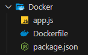
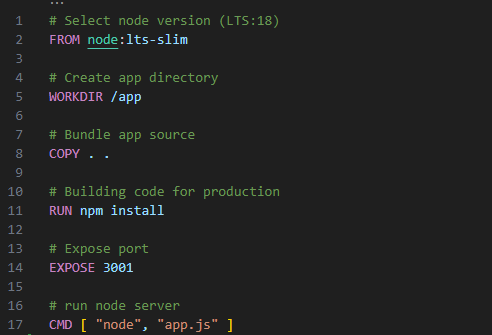
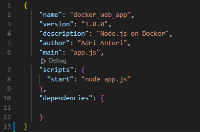
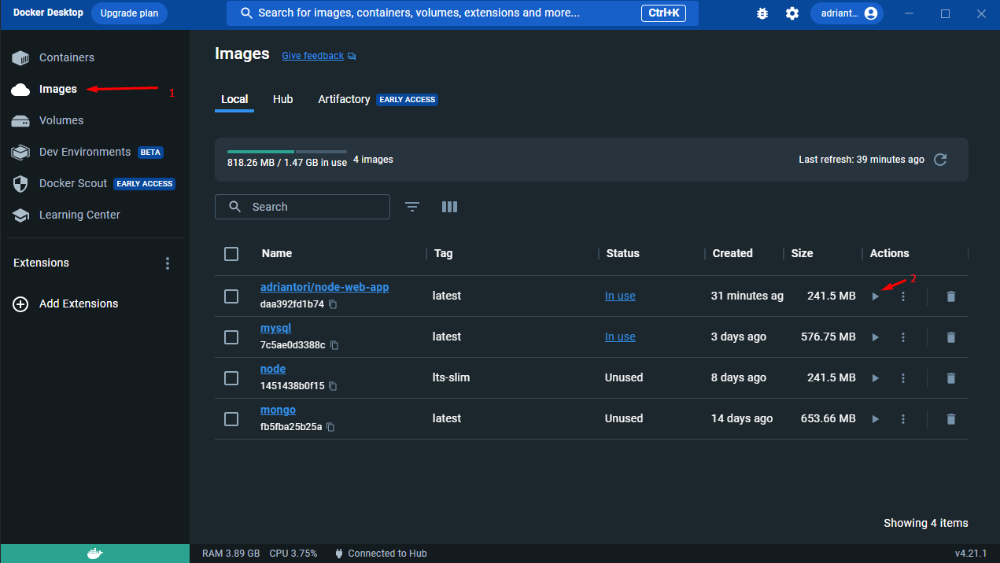
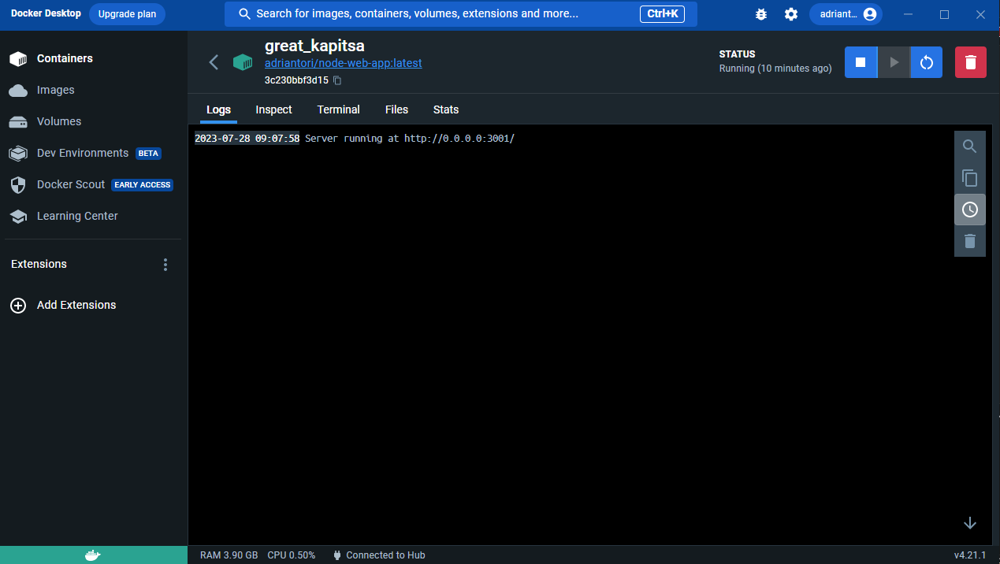

# Week 6 - Docker

This week assignment is to create Dockerized nodejs app.

It starts with installing pre-requisite for Docker application, such as WSL and Linux Kernel Update package, installing the Docker itself, downloading nodeJS image, building the application with Dockerfile, and finally runs the application within Docker.

## WSL installation

1. Press WINDOWS button, search for "command prompt", run as administrator.
   
   

2. Type "wsl --install".

3. Wait until the installation finished, reboot your Windows PC.
   
   

4. Go to: [Linux Kernel Update Package](https://learn.microsoft.com/en-us/windows/wsl/install-manual#step-4---download-the-linux-kernel-update-package)

5. Click the download link
   
   

6. Run the app once its finished downloading, click next until it finished installing.

## Docker Installation

1. Go to : [Install Docker Desktop on Windows | Docker Documentation](https://docs.docker.com/desktop/install/windows-install/)

2. Click "Docker Desktop for Windows".
   
   

3. Run the app once its finished downloading.

4. Once the app finished installing, log off / reboot to finish the installation.

5. Run Command Prompt and enter "docker -v", if it shows the version, then the installation is finished successfully.
   
   

## Docker's First Run

1. Makes sure to Accept the agreement when it popped up for the first time.

2. Click "Sign Up" if you dont have account, otherwise skip to step #4.
   
   

3. Follow the instruction until it finished.
   
   

4. Once finished, you'll need to login to your account.
   
   

5. After you logged in, it will redirect you back to the Docker app.

## Installing NodeJS Images

1. Run Command Prompt.

2. Type "docker pull node:lts-slim", wait until it finished downloading.

## Building Images

1. Prepare 3 files, app.js (the simple nodeJS application), Dockerfile (configuration for docker), and package.json (configuration for nodeJS).
   
   
2. Fill your Dockerfile (without any file extension) just like image below.
   
   
3. Fill your package.json just like image below.
   
   
   
   Important points on the line of code:
   1. Line 6: set the "app.js"  name exactly as your nodejs apps name.
   2. Line 8: same as above, makes sure the "app.js" is exactly the same as your nodejs name.
4. Run "docker build . -t my_nodejs_app" (rename "my_nodejs_app" with your docker filename you want).

## Testing Docker Image

1. Open your Docker desktop app, click on Images tab.

2. Click the "Run" arrow button to start your image.
   
   

3. If the image built and ran successfully, it should show the application running and console logged "Server running at http://0.0.0.0:3001/ ".
   
   
