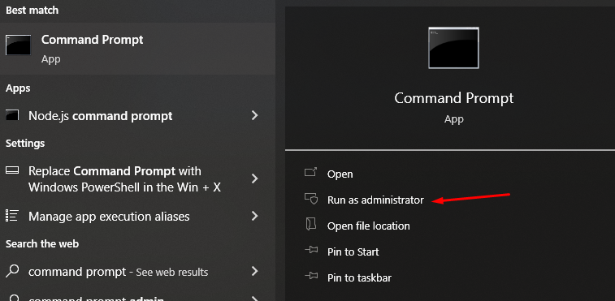
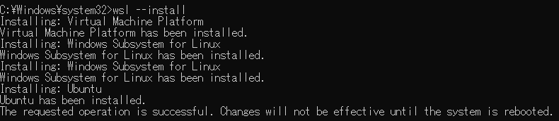
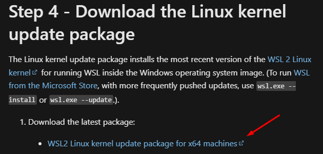
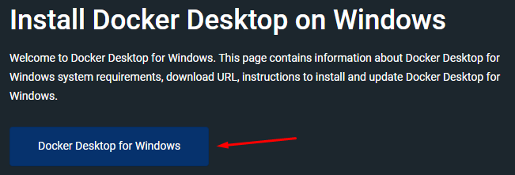
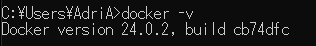
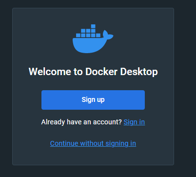
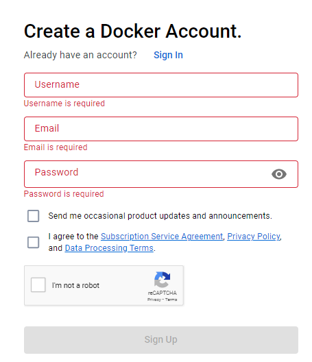
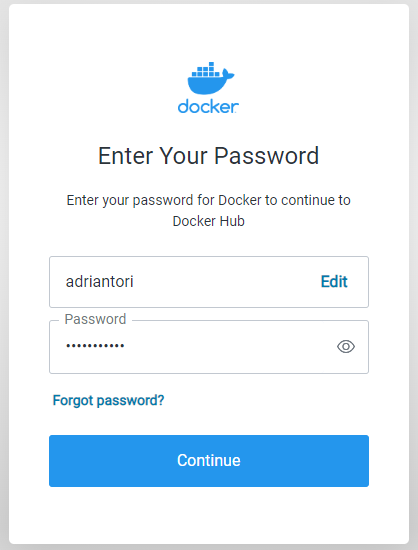

# Week 6 - Docker

## WSL installation

1. Press WINDOWS button, search for "command prompt", run as administrator.
   
   

2. Type "wsl --install".

3. Wait until the installation finished, reboot your Windows PC.
   
   

4. Go to: [Linux Kernel Update Package](https://learn.microsoft.com/en-us/windows/wsl/install-manual#step-4---download-the-linux-kernel-update-package)

5. Click the download link
   
   

6. Run the app once its finished downloading, click next until it finished installing.

## Docker Installation

1. Go to : [Install Docker Desktop on Windows | Docker Documentation](https://docs.docker.com/desktop/install/windows-install/)

2. Click "Docker Desktop for Windows".
   
   

3. Run the app once its finished downloading.

4. Once the app finished installing, log off / reboot to finish the installation.

5. Run Command Prompt and enter "docker -v", if it shows the version, then the installation is finished successfully.
   
   

## Docker's First Run

1. Makes sure to Accept the agreement when it popped up for the first time.

2. Click "Sign Up" if you dont have account, otherwise skip to step #4.
   
   

3. Follow the instruction until it finished.
   
   

4. Once finished, you'll need to login to your account.
   
   

5. After you logged in, it will redirect you back to the Docker app.

## Installing NodeJS Images

1. Run Command Prompt.

2. Type "docker pull node:lts-slim", wait until it finished downloading.

## Building Images

1. Run "docker build . -t my_nodejs_app".
